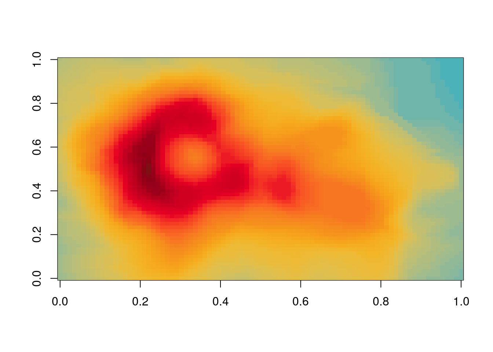
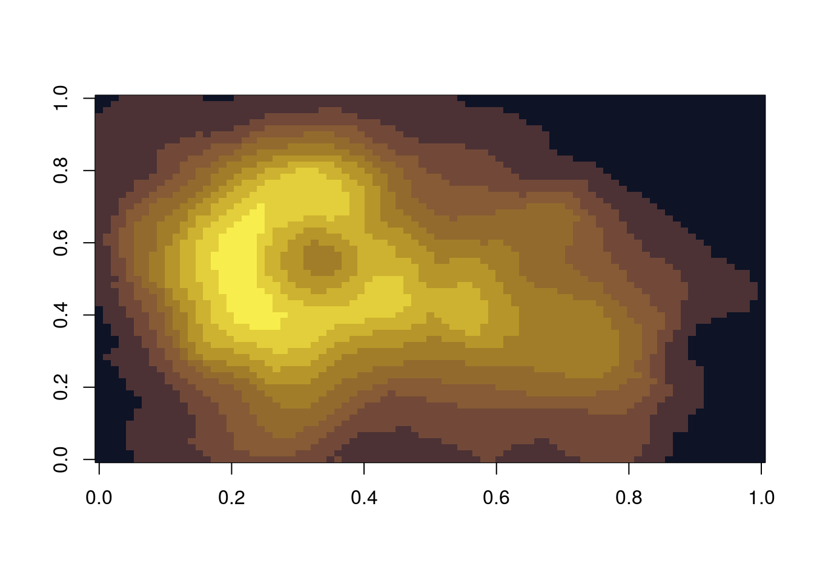
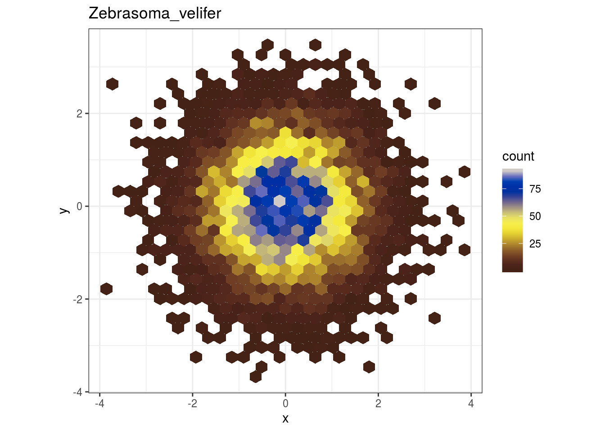
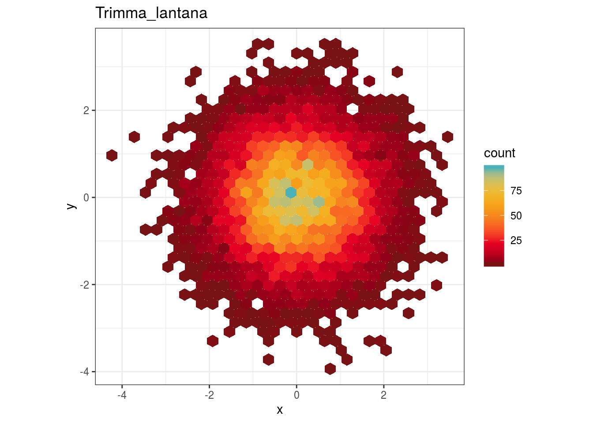
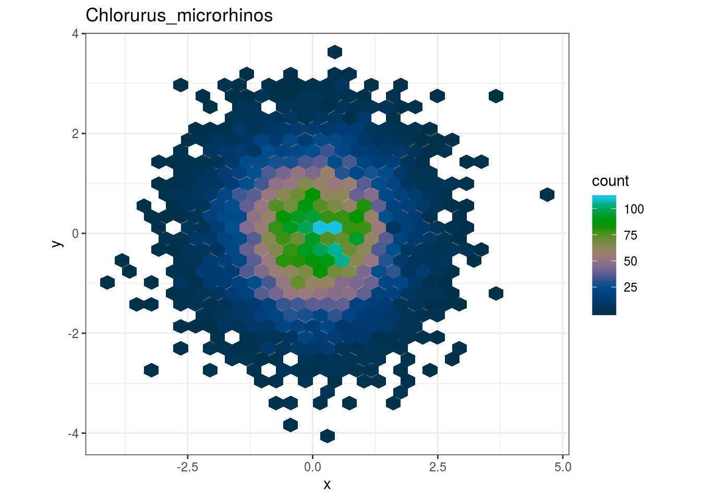
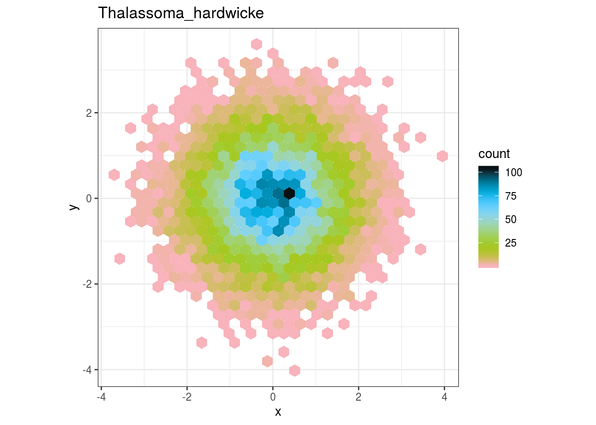
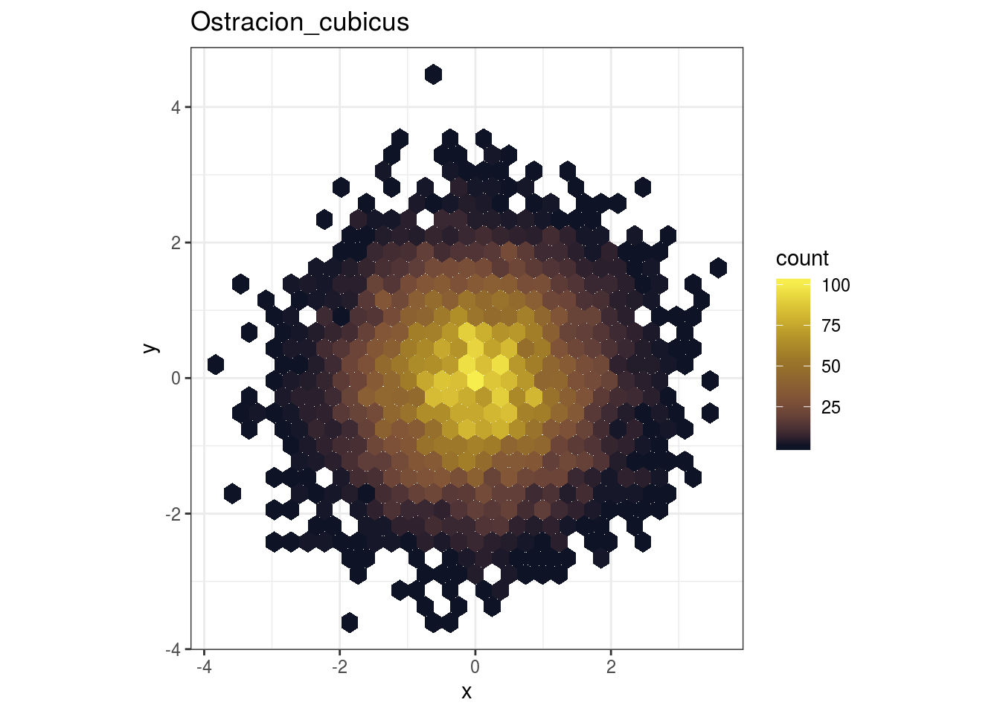
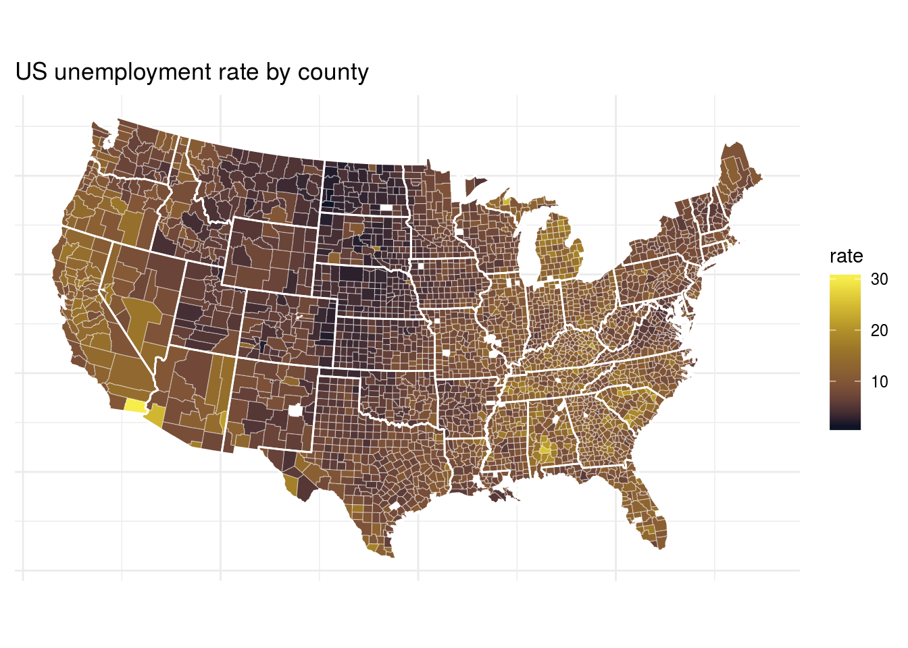
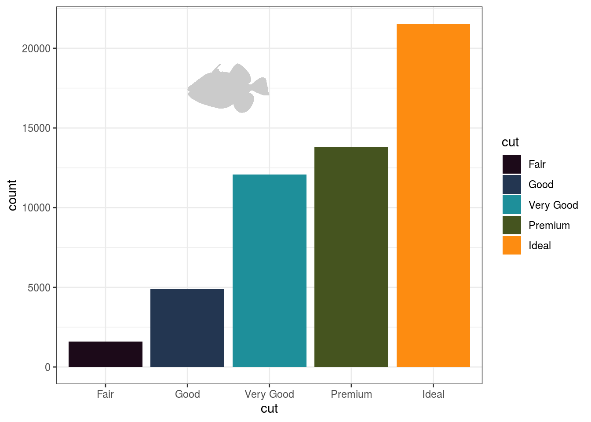

-   [Installation](#installation)
-   [Introduction](#introduction)
-   [The colour scales](#the-colour-scales)
-   [Usage](#usage)

[](https://travis-ci.org/nschiett/fishualize)

`fishualize` allows you to implement the color pattern or your favourite
fish for all you graphs.

Installation
------------

``` r
library(devtools)
devtools::install_github("nschiett/fishualize", force = TRUE)
library(fishualize)
```

Introduction
============

The [**fishualize**](http:://github.com/nschiett/fishualize) package
provides colour scales created by Nina Schiettekatte, Jordan Casey and
Simon Brandl.

The colour scales
=================

The package contains one color scale per species. The amount of color
scales/species will expand over time. To see the fish color scales that
are available, run `fish_palettes()`

Usage
=====

The `fish()` function produces the fish color scale based on your
favourite species, indicated by ‘option’.

For base plots, use the `fish()` function to generate a palette:

``` r
pal <- fish(256, option = "Trimma_lantana")
image(volcano, col = pal)
```



``` r
pal <- fish(10, option = "Ostracion_cubicus")
image(volcano, col = pal)
```



ggplot2
-------

The package also contains color scale functions for **ggplot** plots:
`scale_color_fish()` and `scale_fill_fish()`.

``` r
library(ggplot2)
ggplot(data.frame(x = rnorm(10000), y = rnorm(10000)), aes(x = x, y = y)) +
  geom_hex() + coord_fixed() +
  scale_fill_fish(option = "Zebrasoma_velifer") + theme_bw() +
  labs( title = "Zebrasoma_velifer")
```



``` r
ggplot(data.frame(x = rnorm(10000), y = rnorm(10000)), aes(x = x, y = y)) +
  geom_hex() + coord_fixed() +
  scale_fill_fish(option = "Trimma_lantana") + theme_bw() +
  labs( title = "Trimma_lantana")
```



``` r
ggplot(data.frame(x = rnorm(10000), y = rnorm(10000)), aes(x = x, y = y)) +
  geom_hex() + coord_fixed() +
  scale_fill_fish(option = "Chlorurus_microrhinos") + theme_bw() +
  labs( title = "Chlorurus_microrhinos")
```



``` r
ggplot(data.frame(x = rnorm(10000), y = rnorm(10000)), aes(x = x, y = y)) +
  geom_hex() + coord_fixed() +
  scale_fill_fish(option = "Thalassoma_hardwicke") + theme_bw() +
  labs( title = "Thalassoma_hardwicke")
```



``` r
ggplot(data.frame(x = rnorm(10000), y = rnorm(10000)), aes(x = x, y = y)) +
  geom_hex() + coord_fixed() +
  scale_fill_fish(option = "Ostracion_cubicus") + theme_bw() +
  labs( title = "Ostracion_cubicus")
```



Here the scale based on ‘Ostracion\_cubicus’, ‘Trimma\_lantana’ ,
‘Zebrasoma\_velifer’ and ‘Chlorurus\_microrhinos’ for a cloropleth map
of U.S. unemployment:

``` r
unemp <- read.csv("http://datasets.flowingdata.com/unemployment09.csv",
                  header = FALSE, stringsAsFactors = FALSE)
names(unemp) <- c("id", "state_fips", "county_fips", "name", "year",
                  "?", "?", "?", "rate")
unemp$county <- tolower(gsub(" County, [A-Z]{2}", "", unemp$name))
unemp$county <- gsub("^(.*) parish, ..$","\\1", unemp$county)
unemp$state <- gsub("^.*([A-Z]{2}).*$", "\\1", unemp$name)
county_df <- map_data("county", projection = "albers", parameters = c(39, 45))
names(county_df) <- c("long", "lat", "group", "order", "state_name", "county")
county_df$state <- state.abb[match(county_df$state_name, tolower(state.name))]
county_df$state_name <- NULL
state_df <- map_data("state", projection = "albers", parameters = c(39, 45))
choropleth <- merge(county_df, unemp, by = c("state", "county"))
choropleth <- choropleth[order(choropleth$order), ]

ggplot(choropleth, aes(long, lat, group = group)) +
  geom_polygon(aes(fill = rate), colour = alpha("white", 1 / 2), size = 0.2) +
  geom_polygon(data = state_df, colour = "white", fill = NA) +
  coord_fixed() +
  theme_minimal() +
  ggtitle("US unemployment rate by county") +
  theme(axis.line = element_blank(), axis.text = element_blank(),
        axis.ticks = element_blank(), axis.title = element_blank()) +
  scale_fill_fish(option = "Zebrasoma_velifer")
```



The ggplot functions also can be used for discrete scales with the
argument `discrete=TRUE`.

``` r
p <- ggplot(mtcars, aes(wt, mpg))
p + geom_point(size=4, aes(colour = factor(carb))) +
    scale_color_fish(discrete=TRUE, option = "Thalassoma_hardwicke") +
    theme_bw()
```


Silhouettes
-----------

It is also possible to add fish silhouettes to your plot with the
function `add_silhouette()`.

``` r
library(ggplot2)
ggplot(diamonds)+
  geom_bar(aes(cut, fill = cut)) +
  scale_fill_fish_d(option = "Balistapus_undulatus") +
  fishualize::add_silhouette(option = "Balistapus_undulatus", ymin = 15000, ymax = 20000, xmin = 2, xmax = 3) +
  theme_bw()
```



Credits
-------

All credits for the structure of this package go to the `harrypotter`
package made by Alejandro Jiménez:
<https://github.com/aljrico/harrypotter>
