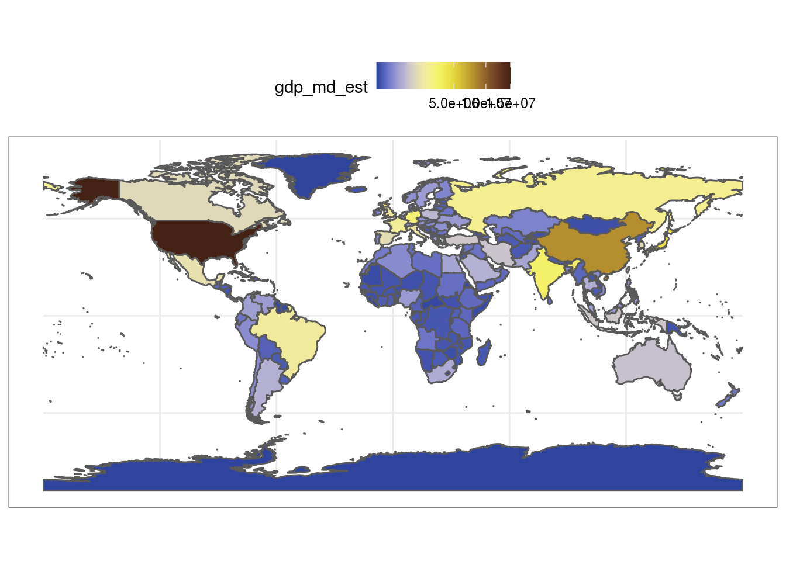
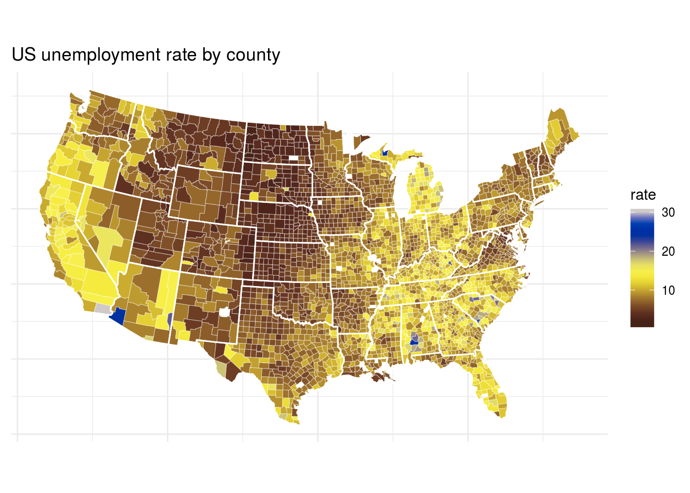
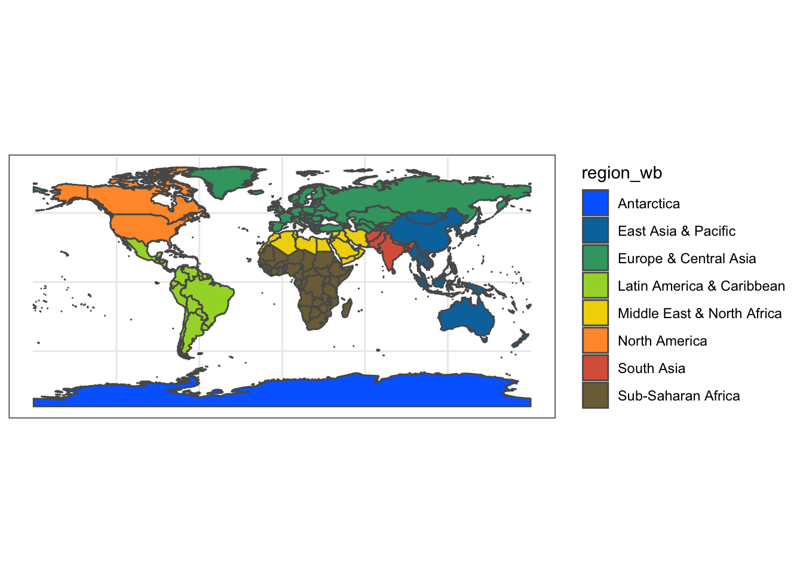
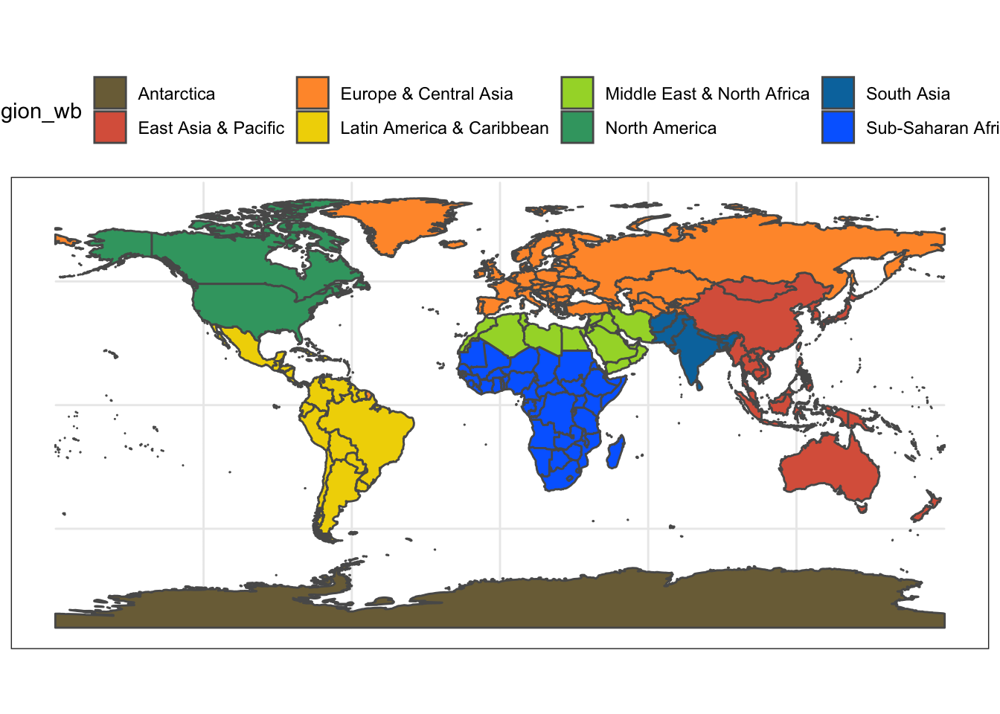
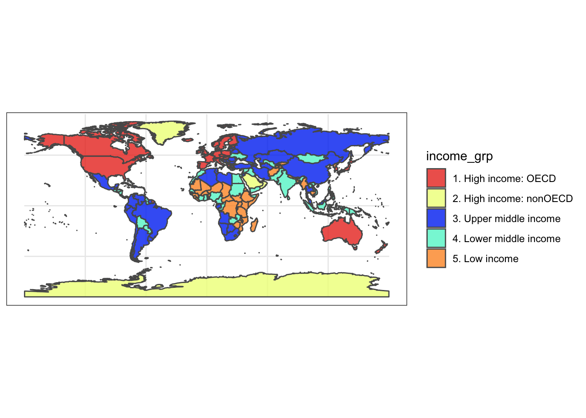

-   [Introduction](#introduction)
-   [The color scales](#the-color-scales)
-   [Usage](#usage)

[](https://travis-ci.org/nschiett/fishualize)
\[


Introduction
============

The [**fishualize**](http:://github.com/nschiett/fishualize) package
provides color scales for plotting in R based on nature’s most stunning
and colorful organisms: teleost fishes (with a few chondrichthyan
cameos). \#TeamFish in its colorful glory.

Installation
------------

``` r
library(devtools)
devtools::install_github("nschiett/fishualize", force = TRUE)
library(fishualize)
```

The color scales
================

The package contains one scale per species, defined by five dominant
colors. The number of fishualized species will expand over time. For a
list of fish species that are currently available, run
`fish_palettes()`.  
A visual overview of the color scales can be found
[here](https://nschiett.github.io/fishualize/articles/overview_colors.html).

Usage
=====

The `fish()` function produces the fish color scale based on your
favorite species, which can be specified using ‘option’ =
“Your\_favorite” or fish\_palettes()\[\] with the number of your species
specified.

For base R plots, use the `fish()` function to generate a palette:

``` r
pal <- fish(256, option = "Trimma_lantana")
image(volcano, col = pal)
```


``` r
pal <- fish(10, option = "Ostracion_cubicus")
image(volcano, col = pal)
```


ggplot2
-------

The package also contains color scale functions for **ggplot** plots:
`scale_color_fish()` and `scale_fill_fish()`.

``` r
library(ggplot2)
library(rfishbase)

# load data for plotting 
# 1. Create list of species names currently featured in fishualize
spp <- fishualize::fish_palettes()
# 2. Get data on the included species from FishBase using the rfishbase package
dt <- rfishbase::species(gsub("_"," ", spp))

# plot bars with discrete colors using color scheme provided by Scarus quoyi
ggplot(dt[!is.na(dt$Importance),]) +
  geom_bar(aes(x = Importance, fill = Importance)) +
  scale_fill_fish_d(option = "Scarus_quoyi") +
  theme_bw() +
  theme(axis.text.x= element_blank() )
```


``` r
# plot points with continuous colors provided by Hypsypops rubicundus
ggplot(dt) +
  geom_point(aes(x = Length, y = Vulnerability, color = Vulnerability), size = 3) +
  scale_color_fish(option = "Hypsypops_rubicundus", direction = -1) +
  theme_bw()
```

    ## Warning: Removed 1 rows containing missing values (geom_point).


``` r
# get ecological information from FishBase
data <- rfishbase::ecology(gsub("_"," ", spp), c("SpecCode","FeedingType", "DietTroph")) %>% 
  dplyr::left_join( rfishbase::species(gsub("_"," ", spp)))

# plot boxplots of length across feeding groups using discrete colors provided by Cirrilabrus solorensis
ggplot(data[!is.na(data$FeedingType),]) +
  geom_boxplot(aes(x = FeedingType, y = log(Length), fill = FeedingType )) +
  scale_fill_fish_d(option = "Cirrhilabrus_solorensis") +
  theme_bw() +
  theme(axis.text.x= element_blank() )
```


``` r
# examine relationships between size and trophic level with vulnerability as a continuous color scheme provided by Lepomis megalotis
ggplot(data) +
  geom_point(aes(x = Length, y = DietTroph, color = Vulnerability), size = 6, alpha = 0.9) +
  scale_color_fish(option = "Lepomis_megalotis", direction = -1) +
  theme_bw()
```

    ## Warning: Removed 44 rows containing missing values (geom_point).


Colors can also be used with maps. Here are several examples of discrete
and continuous color schemes on a world-map.

``` r
#load rnaturalearth and rnaturalearthdata packages
library("rnaturalearth")
library("rnaturalearthdata")

#get dataset of the world's countries
world <- ne_countries(scale = "medium", returnclass = "sf")

#plot worldmap with each country's estimated population as a continuous colors scale based on the reverse colors of Whitley's Boxfish Ostracion whitleyi
ggplot(data = world) +
  geom_sf(aes(fill = pop_est)) +
  scale_fill_fish(option = "Ostracion_whitleyi", direction = -1) +
  theme_bw()
```


``` r
#plot worldmap with each country's estimated gdp based on the colors of the Sailfin Tang Zebrasoma velifer
ggplot(data = world) +
  geom_sf(aes(fill = gdp_md_est)) +
  scale_fill_fish(option = "Zebrasoma_velifer", trans = "sqrt") +
  theme_bw()
```



``` r
#same example as above but starting at a lighter point of the color scale
ggplot(data = world) +
  geom_sf(aes(fill = gdp_md_est)) +
  scale_fill_fish(option = "Zebrasoma_velifer", trans = "sqrt", begin = 0.3, end = 1) +
  theme_bw()
```



``` r
#plot worldmap again, this time with countries colored by their respective regional affiliation using the colors of the Clown coris *Coris gaimard* and 'discrete = TRUE'
ggplot(data = world) +
  geom_sf(aes(fill = region_wb)) +
  scale_fill_fish(option = "Coris_gaimard", discrete = TRUE) +
  theme_bw()
```



``` r
##same map with colors reversed
ggplot(data = world) +
  geom_sf(aes(fill = region_wb)) +
  scale_fill_fish(option = "Coris_gaimard", discrete = TRUE, direction = -1) +
  theme_bw()
```



``` r
#another map with countries colored by economic status using the colors of the Mandarinfish *Synchiropus splendidus*
ggplot(data = world) +
  geom_sf(aes(fill = income_grp)) +
  scale_fill_fish(option = "Synchiropus_splendidus", discrete = T, alpha = 0.8) +
  theme_bw()
```



Contribute
----------

Check out how you can contribute to this package
[here](https://nschiett.github.io/fishualize/articles/contribute.html)

Credits
-------

Credits for the initial structure of the functions for this package go
to the `harrypotter` package made by Alejandro Jiménez:
<a href="https://github.com/aljrico/harrypotter" class="uri">https://github.com/aljrico/harrypotter</a>
